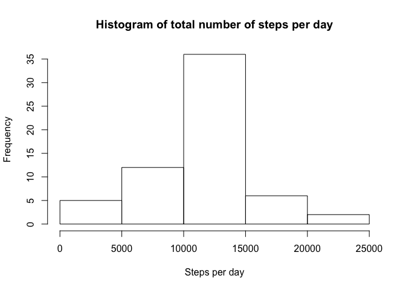
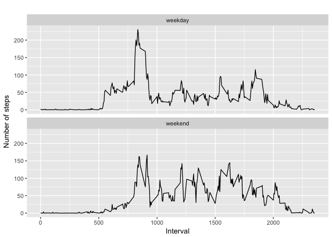

# Reproducible Research: Peer Assessment 1


## Loading and preprocessing the data
To load the raw data we use the file from the URL and save it into "datos""

```r
temp <- tempfile()
download.file("https://d396qusza40orc.cloudfront.net/repdata%2Fdata%2Factivity.zip",temp)
datos <- read.csv(unz(temp, "activity.csv"))
unlink(temp)
```

now lets have a look to the data loaded

```r
str(datos)
```

```
## 'data.frame':	17568 obs. of  3 variables:
##  $ steps   : int  NA NA NA NA NA NA NA NA NA NA ...
##  $ date    : Factor w/ 61 levels "2012-10-01","2012-10-02",..: 1 1 1 1 1 1 1 1 1 1 ...
##  $ interval: int  0 5 10 15 20 25 30 35 40 45 ...
```

## What is mean total number of steps taken per day?
To do that we aggregate by date using sum function, and ignore the NA values

```r
meanSteps_bydate <- aggregate(steps ~ date, datos, sum)
```

The results...

```r
str(meanSteps_bydate)
```

```
## 'data.frame':	53 obs. of  2 variables:
##  $ date : Factor w/ 61 levels "2012-10-01","2012-10-02",..: 2 3 4 5 6 7 9 10 11 12 ...
##  $ steps: int  126 11352 12116 13294 15420 11015 12811 9900 10304 17382 ...
```

now we are going to explore the distribution per day

```r
hist(meanSteps_bydate$steps, main= "Histogram of total number of steps per day",xlab = "Steps per day")
```

<!-- -->

Now we calculate and report the mean and median of the total number of steps taken per day

```r
#Mean
mean(meanSteps_bydate$steps)
```

```
## [1] 10766.19
```

```r
#Median
median(median(meanSteps_bydate$steps))
```

```
## [1] 10765
```

## What is the average daily activity pattern?
we calculate the mean by interval 

```r
mean_by_intv <- aggregate(steps ~ interval, datos, mean)

#then we plot it

plot(steps ~ interval,mean_by_intv, type = "l")
```

<!-- -->
The interval with the maximum average steps

```r
mean_by_intv[which.max(mean_by_intv$steps),]
```

```
##     interval    steps
## 104      835 206.1698
```

## Imputing missing values
First we calculate and describe the missing data, wich arte 2.304 in total


```r
#select all missing
pruebamising <- datos[!complete.cases(datos),]

#make a summary
summary(pruebamising)
```

```
##      steps              date        interval     
##  Min.   : NA    2012-10-01:288   Min.   :   0.0  
##  1st Qu.: NA    2012-10-08:288   1st Qu.: 588.8  
##  Median : NA    2012-11-01:288   Median :1177.5  
##  Mean   :NaN    2012-11-04:288   Mean   :1177.5  
##  3rd Qu.: NA    2012-11-09:288   3rd Qu.:1766.2  
##  Max.   : NA    2012-11-10:288   Max.   :2355.0  
##  NA's   :2304   (Other)   :576
```

To impute missing values we are going to make a loop and impute using the interval as a pivot


```r
#First make a copy of the original data
data_imputed <- datos
#then the loop through all the data imputing 
for (i in 1:nrow(data_imputed)) {
  if (is.na(data_imputed$steps[i])) {
    interval_value <- data_imputed$interval[i]
    steps_value <- mean_by_intv[mean_by_intv$interval == interval_value,]
    data_imputed$steps[i] <- steps_value$steps
  }
}
```
# now we repeat the first step of the analysis but with the new data set

```r
meanSteps_bydate_imputed <- aggregate(steps ~ date, data_imputed, sum)
```

The results...

```r
str(meanSteps_bydate_imputed)
```

```
## 'data.frame':	61 obs. of  2 variables:
##  $ date : Factor w/ 61 levels "2012-10-01","2012-10-02",..: 1 2 3 4 5 6 7 8 9 10 ...
##  $ steps: num  10766 126 11352 12116 13294 ...
```

now we are going to explore the distribution per day

```r
hist(meanSteps_bydate_imputed$steps, main= "Histogram of total number of steps per day",xlab = "Steps per day")
```

<!-- -->

Now we calculate and report the mean and median of the total number of steps taken per day

```r
#Mean
mean(meanSteps_bydate_imputed$steps)
```

```
## [1] 10766.19
```

```r
#Median
median(median(meanSteps_bydate_imputed$steps))
```

```
## [1] 10766.19
```

## Are there differences in activity patterns between weekdays and weekends?
First we recognize wich day of the week is the date, then we classify it

```r
data_imputed['week_day'] <- weekdays(as.Date(data_imputed$date))
data_imputed$week_day[data_imputed$week_day  %in% c('Saturday','Sunday') ] <- "weekend"
data_imputed$week_day[data_imputed$week_day != "weekend"] <- "weekday"
```

Now we plot it using ggplot2, so first if you don't have it, install it


```r
# install.packages("ggplot2")
library(ggplot2)
```

```
## Warning: package 'ggplot2' was built under R version 3.3.2
```

```r
# convert week_day from character to factor
data_imputed$week_day <- as.factor(data_imputed$week_day)

# calculate average steps by interval
imputed_stepsby_interval <- aggregate(steps ~ interval + week_day, data_imputed, mean)

# creat a plot
qplot(interval, 
      steps, 
      data = imputed_stepsby_interval, 
      type = 'l', 
      geom=c("line"),
      xlab = "Interval", 
      ylab = "Number of steps", 
      main = "") +
  facet_wrap(~ week_day, ncol = 1)
```

```
## Warning: Ignoring unknown parameters: type
```

<!-- -->
